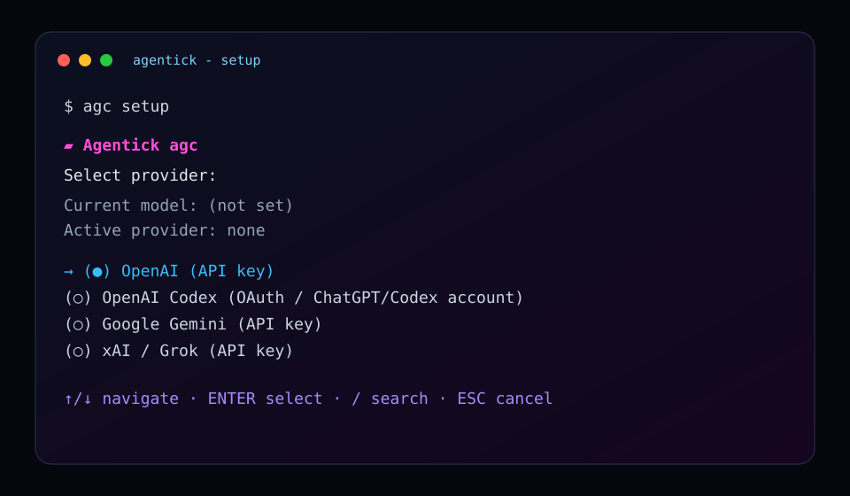
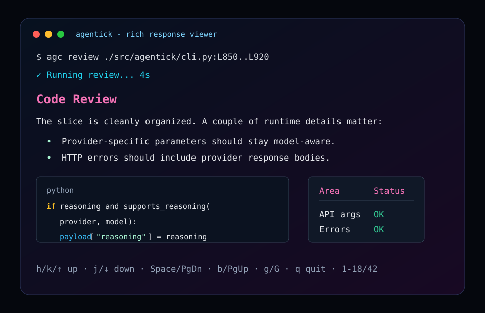

# Agentick (`agc`)

Agentick turns the AI workflows you actually repeat into tiny terminal commands.

Instead of rebuilding the same chat context every time, save the prompt once and
run it against the file, line slice, traceback, diff, branch, or incident log in
front of you:

```bash
agc pr-risk ./src/payments/checkout.ts:L80..L180
agc explain-trace ./tmp/prod-500.log > incident-notes.md
agc api-migration ./openapi-before.json ./openapi-after.json
agc branch-watch main --agent --allow-shell --allow-write
agc release-drafter ./git-log.txt > CHANGELOG-draft.md
```

Agentick is intentionally small: provider setup, reusable prompt tasks, runtime
arguments, file/line injection, optional agentic tool loops, schedulable routines,
a rich terminal viewer, and clean shell-native redirection. No dashboard required.



## The problem

AI is useful, but a lot of developer AI work still lives in copy-paste chat
sessions:

- The same prompt gets rewritten over and over.
- Good prompts are not named, versioned, or shared like code.
- Files and line ranges must be copied manually into a browser.
- Outputs are hard to pipe into normal tools, save to files, or use in scripts.
- Provider setup often fails late, after you already tried to run a task.
- Terminal users lose flow when they have to leave the shell for every repeated
  AI operation.

Agentick fixes that narrow problem: it makes repeatable AI prompts behave like
small CLI commands. A prompt can live as a task, accept arguments, read files,
call your configured provider, and return output in a terminal-native way.

## How Agentick works

The flow is deliberately simple:

```text
1. agc setup
   Configure one working AI provider: OpenAI, OpenRouter, Anthropic, Gemini,
   xAI/Grok, DeepSeek, Kimi, DashScope/Qwen, MiniMax, Hugging Face, NVIDIA,
   or another OpenAI-compatible provider.

2. agc new ./prompt.md review
   Save a reusable prompt task under ~/.agentick/tasks/review.json.

3. agc review ./src/app.py:L40..L120
   Agentick loads the task, injects args/files, calls the provider, and shows
   the response in a rich terminal viewer.

4. agc review ./src/app.py > review.md
   If stdout is redirected, Agentick skips UI chrome and writes raw output.
```

At runtime, Agentick:

1. checks that internet and a configured provider are available;
2. loads the saved task by name;
3. substitutes placeholders such as `{{arg:0}}` and `{{file:0}}`;
4. reads file paths or line slices passed on the command line;
5. sends the final prompt to the selected AI provider;
6. displays markdown/tables/code in the interactive viewer, or prints raw text
   for shell pipelines and redirection.

This keeps AI workflows close to the codebase and compatible with normal Unix
and PowerShell habits.

## Examples worth stealing

Agentick is most interesting when the task name captures a real repeatable
workflow, not a generic "ask AI" action:

```bash
# Point a focused reviewer at only the risky slice you changed.
agc pr-risk ./src/billing/stripe_webhook.py:L42..L170

# Turn a production traceback into a concise handoff without terminal chrome.
agc incident-handoff ./logs/prod-500.txt > handoff.md

# Compare two API specs and draft the migration notes your customers need.
agc api-migration ./openapi-v1.json ./openapi-v2.json > migration.md

# Explain why a query plan is slow, using a cheaper/low-reasoning task config.
agc query-plan ./plans/slow-checkout.sql

# Ask an agentic routine to keep a branch conflict-ready in the background.
agc routines create branch-watch --every 15m --arg main --agent --allow-shell --allow-write

# Generate release notes from the exact commits you are about to ship.
git log --oneline origin/main..HEAD > /tmp/release-log.txt
agc release-drafter /tmp/release-log.txt > CHANGELOG-draft.md
```

Good task names read like local tools: `pr-risk`, `incident-handoff`,
`api-migration`, `query-plan`, `branch-watch`, `release-drafter`. The prompt
behind each command can be strict about tone, output schema, model, reasoning,
and exactly which files or line slices should be injected.

## Productive Workflow
Agentick is useful when a prompt becomes part of your workflow:

- Review risky code slices: `agc pr-risk ./src/server.py:L80..L180`
- Debug production failures: `agc explain-trace ./traceback.txt`
- Draft incident handoffs: `agc incident-handoff ./logs/outage.txt > handoff.md`
- Compare API contracts: `agc api-migration ./openapi-old.json ./openapi-new.json`
- Summarize query plans: `agc query-plan ./plans/checkout.sql`
- Generate release notes: `agc release-drafter ./git-log.txt > CHANGELOG-draft.md`
- Learn unfamiliar code paths: `agc explain-path ./src/payment.ts:L80..L160`
- Keep routine repo work warm: create `branch-watch`, then schedule it with
  `agc routines create branch-watch --every 15m --arg main --agent --allow-shell`

The productivity win is simple: prompts become named, versionable, repeatable
commands that accept arguments and files.

## Token and cost efficiency

Agentick can also help reduce token usage and provider spend when you design
tasks intentionally. Because each task can store its own model, reasoning effort,
system prompt, and file/argument pattern, you do not have to use the biggest or
most expensive settings for every job.

For example:

- Use a fast, cheaper model with low/minimal reasoning for simple summarization,
  rewriting, changelog drafts, naming, or formatting tasks.
- Reserve stronger models or higher reasoning effort for code review,
  debugging, architecture, or other tasks that genuinely need deeper analysis.
- Inject only the file slice the task needs, such as `./app.py:L40..L120`,
  instead of pasting an entire file or repository into a chat window.
- Keep prompts focused and reusable so every run starts from a known compact
  instruction instead of a long ad-hoc conversation.

Savings are not automatic: they depend on the provider pricing, model choice,
prompt size, output length, and reasoning settings you choose. The point is that
Agentick makes those choices explicit per task, so routine low-intensity work can
run with lean parameters while important work still gets the model/settings it
needs.

## Highlights

- `agc setup` for OpenAI, OpenRouter, Anthropic, Gemini, xAI/Grok, DeepSeek,
  Z.AI/GLM, Kimi/Moonshot, Alibaba/DashScope, MiniMax, Hugging Face, NVIDIA,
  Xiaomi MiMo, Kilo Code, AI Gateway, OpenCode, LM Studio, Ollama Cloud, and
  Tencent TokenHub.
- API-key and supported OAuth/device-code setup paths.
- Strict readiness gate: non-setup commands refuse to run until a provider,
  credentials, and internet connectivity are present.
- Create reusable tasks from `.txt`, `.md`, `.yaml`, `.yml`, or `.json`.
- Interactive `agc new` supports one-line prompts or `$EDITOR` for multiline
  prompts, plus task-specific model, reasoning, and optional parameter descriptions.
- Runtime placeholders: `{{arg:0}}`, `{{arg:1}}`, ...
- File injection placeholders: `{{file:0}}`, `{{file:1}}`, ...
- Line slices: `./file.py:L10..L40` or `./file.py:10..40`.
- Agentic mode for multi-step workflows that can inspect files, call URLs, edit
  files, run verification commands, inspect git diffs, and create commits when
  the matching explicit permissions are passed.
- Rich interactive response viewer with markdown, tables, and syntax-highlighted
  code blocks.
- Vim-style response navigation: `h`/`j`, `k`, arrow keys, PageUp/PageDown,
  `g`, `G`, `q`.
- Shell-native output: `agc task > file.md` writes raw model output without UI
  chrome or ANSI styling.
- Secure local storage: `~/.agentick` is private, and config/task files are
  written with restrictive permissions where the OS supports them.



Screenshots show Agentick's ANSI colors, markdown rendering, code highlighting,
and viewer layout. Exact font shape and programming ligatures depend on the
terminal/font you use; Agentick does not require or inject a custom font.

## Requirements

- Python 3.11+
- Internet access for AI provider calls
- At least one provider credential. Common options:
  - `OPENAI_API_KEY`
  - `OPENROUTER_API_KEY`
  - `ANTHROPIC_API_KEY` (also checks `ANTHROPIC_TOKEN` / `CLAUDE_CODE_OAUTH_TOKEN`)
  - `GEMINI_API_KEY` or `GOOGLE_API_KEY`
  - `XAI_API_KEY`
  - `DEEPSEEK_API_KEY`
  - `GLM_API_KEY`, `KIMI_API_KEY`, `DASHSCOPE_API_KEY`, `MINIMAX_API_KEY`, `HF_TOKEN`, `NVIDIA_API_KEY`, or another provider key shown by `agc setup`
  - or an OAuth/device-code path exposed by `agc setup`

## Installation

### macOS

```bash
git clone <your-agentick-repo-url>
cd agentick
bash scripts/install.sh
```

The installer creates an isolated virtualenv at `~/.agentick/venv`, installs
Agentick, and updates your shell profile for future terminals.

For the current terminal, either open a new terminal or run the profile command
printed by the installer, for example:

```bash
source ~/.zshrc
agc setup
```

If you prefer not to edit your shell profile:

```bash
bash scripts/install.sh --no-shell-profile
export PATH="$HOME/.agentick/venv/bin:$PATH"
agc setup
```

### Linux

```bash
git clone <your-agentick-repo-url>
cd agentick
bash scripts/install.sh
source ~/.bashrc   # or source the profile file printed by the installer
agc setup
```

Custom Python or install prefix:

```bash
bash scripts/install.sh --python python3.12 --prefix ~/.local/share/agentick/venv
export PATH="$HOME/.local/share/agentick/venv/bin:$PATH"
```

### Windows PowerShell

```powershell
git clone <your-agentick-repo-url>
cd agentick
powershell -ExecutionPolicy Bypass -File .\scripts\install.ps1
```

Open a new PowerShell window, then run:

```powershell
agc setup
```

If you do not want the installer to update your user `Path`:

```powershell
powershell -ExecutionPolicy Bypass -File .\scripts\install.ps1 -NoUserPath
$env:Path = "$HOME\.agentick\venv\Scripts;$env:Path"
agc setup
```

### Development install

```bash
git clone <your-agentick-repo-url>
cd agentick
python3 -m venv .venv
. .venv/bin/activate
python -m pip install -e '.[dev]'
python -m pytest
```

## First setup

Interactive setup:

```bash
agc setup
```

Non-interactive API-key examples:

```bash
OPENAI_API_KEY="..." agc setup --provider openai --model gpt-4o-mini --reasoning minimal --no-interactive
OPENROUTER_API_KEY="..." agc setup --provider openrouter --model anthropic/claude-sonnet-4.6 --reasoning medium --no-interactive
ANTHROPIC_API_KEY="..." agc setup --provider anthropic --model claude-sonnet-4-6 --reasoning medium --no-interactive
GEMINI_API_KEY="..." agc setup --provider gemini --model gemini-3-flash-preview --reasoning medium --no-interactive
XAI_API_KEY="..." agc setup --provider xai --model grok-4.3 --reasoning medium --no-interactive
DEEPSEEK_API_KEY="..." agc setup --provider deepseek --model deepseek-chat --reasoning medium --no-interactive
```

The interactive picker also lists Z.AI/GLM, Kimi/Moonshot, Alibaba/DashScope,
MiniMax, Hugging Face, NVIDIA NIM, Xiaomi MiMo, Kilo Code, AI Gateway, OpenCode,
LM Studio, Ollama Cloud, and Tencent TokenHub. Most of these use
OpenAI-compatible `/chat/completions`; Anthropic uses the native Messages API;
Gemini uses Google `generateContent`.

OpenAI Codex OAuth/device-code setup is also available from the interactive
setup picker. Agentick opens your browser or shows a device code; you do not
need to paste a token for the interactive path. Codex OAuth uses the
ChatGPT/Codex backend (`chatgpt.com/backend-api/codex/responses`), not the
platform API-key endpoint, so a stray `OPENAI_API_KEY` environment variable will
not override a saved Codex OAuth token. Choose `OpenAI (API key)` instead when
you want to use a platform key from `platform.openai.com`.

## Creating tasks

Create a markdown prompt:

```md
---
system: You are a precise senior engineer. Be concise and actionable.
---
Review this code:

{{file:0}}
```

Save it as `review.md`, then create a task:

```bash
agc new ./review.md review --no-interactive
# Or pin this task to a specific model/reasoning profile:
agc new ./review.md review-fast --model gpt-4o-mini --reasoning minimal --no-interactive
```

In interactive mode, `agc new` asks for the provider, prompt source, model, and
reasoning effort. Choose `Provider default (...)` if the task should inherit the
provider-level model configured by `agc setup`, or select/paste a task-specific
model when this task should always run differently.

Run it:

```bash
agc review ./src/agentick/cli.py:L850..L930
```

After creation, Agentick saves the task to:

```text
~/.agentick/tasks/review.json
```

The original `review.md` is copied into the task at creation time. Later edits
to `review.md` do not automatically change the saved task. To edit the saved
copy, open it in `$VISUAL`/`$EDITOR`:

```bash
agc edit review
```

Or replace it from an updated prompt file non-interactively:

```bash
agc edit review ./review.md --no-interactive
```

Edit can also update task-level defaults and agent mode:

```bash
agc edit review ./review.md --model gpt-4o-mini --reasoning low --no-interactive
agc edit review ./agent-review.md --agent --no-interactive
agc edit review ./review.md --no-agent --no-interactive
```

Delete a saved task when you no longer need it:

```bash
agc delete review
```

In non-interactive scripts, pass `--yes` so deletion cannot happen by accident:

```bash
agc delete review --yes --no-interactive
# alias: agc rm review --yes --no-interactive
```

## Arguments and files

Use positional args:

```md
Explain {{arg:0}} for {{arg:1}}.
```

Run:

```bash
agc explain "TLS handshakes" "a backend engineer"
```

Use file injection:

```md
Summarize this file:

{{file:0}}
```

Run:

```bash
agc summarize ./README.md
agc summarize ./src/agentick/cli.py:L1..L80
```

`{{arg:0}}` and `{{file:0}}` intentionally do different things:

- `{{arg:0}}` inserts the literal first argument string, such as
  `./main.c:L3..L5`.
- `{{file:0}}` treats the first argument as a file path or file/line slice and
  injects the selected file contents.

For code-slice tasks, include both when the path/range is useful context:

```md
Search for implementations similar to this selection from {{arg:0}}:

{{file:0}}
```

```bash
agc impl ./main.c:L3..L5
```

Relative file paths are resolved from the current working directory where `agc`
is invoked, not from `~/.agentick/tasks` and not from the original prompt file's
location. For example, if you run `agc impl ./main.c:L3..L5` from a project root,
Agentick reads `./main.c` in that project root.

If a task has no explicit `{{arg:n}}` or `{{file:n}}` placeholders, Agentick
appends runtime arguments under an `Arguments:` section.

For long paragraph-style arguments, use the editor input flag instead of trying
to fit everything into one shell argument:

```bash
agc incident-handoff --edit-args
# alias: agc incident-handoff --args-editor
```

Agentick opens `$VISUAL`, `$EDITOR`, or `vim` once per detected parameter. The
editor buffer starts with a heading like `# Parameter 1: incident notes`; do not
edit that heading or marker. Paste the argument below the marker, save, and quit.
The heading comes from optional parameter descriptions captured during
interactive `agc new`, or from prompt frontmatter such as:

```md
---
param_0: "incident notes pasted from Slack"
---
Summarize this incident and produce a handoff:\n{{arg:0}}
```

## Agentic workflows

Normal tasks are single-shot: user prompt -> AI -> response. Agentic tasks add a
bounded loop: user prompt -> AI decides next action -> Agentick runs one tool ->
AI observes the result -> repeat until final answer. This lets a saved task do
real developer work without leaving the terminal.

Create an agentic task either with frontmatter:

```md
---
system: You are a careful implementation agent. Inspect before editing and run tests.
agent: true
---
Implement the requested change: {{arg:0}}
```

or with a CLI flag:

```bash
agc new ./implement.md implement --agent --no-interactive
```

Run it with explicit capabilities:

```bash
agc implement "add validation tests" --agent --allow-write --allow-shell
agc implement "finish and commit" --agent --allow-write --allow-shell --allow-commit
```

Available agent tools are intentionally small and auditable:

```text
read_file     read files under the current directory
write_file    create/overwrite files, requires --allow-write
patch_file    targeted string replacement, requires --allow-write
shell         run scoped verification/build commands, requires --allow-shell
curl          make HTTP requests, requires --allow-net
git_status    inspect working tree
git_diff      inspect unstaged changes
git_commit    git add -A && git commit -m, requires --allow-commit
```

Agentick writes the last tool transcript to
`~/.agentick/last_agent_trace.json`, writes the latest per-task markdown run log
to `~/.agentick/runs/<task-name>.md`, and also keeps timestamped execution
history under `~/.agentick/runs/history/<task-name>/<run-id>.md`. Full task chat
sessions are persisted under
`~/.agentick/conversations/history/<task-name>/<session-id>.md` plus a JSON copy
unless the run used `--no-context`.
Run logs include the task/response, model, reasoning effort, and
provider-reported token usage when available (`total`, `input`, and `output`
tokens). This makes agentic runs inspectable when a model makes a bad call, lets
you view older answers after newer runs replace the latest log, and lets you
reopen the full prompt/reply transcript for a particular execution session. File
paths are constrained to the current working directory; writes, shell commands,
outbound HTTP(S) requests, and commits are opt-in per run.

View the last prepared result for any task/routine with the same scrollable
viewer used for model responses:

```bash
agc routines view implement
agc routines view implement --headless   # raw log for scripts/redirection
```

List previous answers and reopen a specific run:

```bash
agc history                       # recent runs for all tasks
agc history implement             # previous answers for one task
agc history view implement <run-id>
agc history view implement <run-id> --headless
```

List persisted chat sessions, reopen the full transcript for a specific
execution session, or resume that session later:

```bash
agc chats                         # recent chat sessions for all tasks
agc chats implement               # chat sessions for one task
agc chats view implement <session-id>
agc chats view implement <session-id> --headless
agc chats resume implement <session-id>
agc chats resume implement <session-id> --reply "continue from here" --headless
agc chats resume implement <session-id> --edit-reply
agc chats context implement <session-id> --headless
agc chats compact implement <session-id>
agc chats reset implement <session-id> --yes   # delete one saved context
agc chats reset implement --yes                # delete all saved context for a task
```

Use `--no-context` on a fresh task run when you want a one-off answer and do not
want Agentick to persist a resumable chat transcript:

```bash
agc implement ./src/app.py --no-context
```

`agc chats resume` loads the saved JSON transcript, appends your new reply, calls
the configured provider with the full prior message history, and overwrites the
same `.md`/`.json` session files with the extended conversation. In an
interactive terminal it opens the same response viewer as a fresh run. The footer
keeps only the top hotkeys visible (`R` reply, `C` compact context, `q` quit) plus
`?` for a full hotkey overlay; press `?` or `q` inside that overlay to close it
and resume. `E`/`V` opens `$VISUAL`, `$EDITOR`, or `vim` for a multiline reply.
Inside the quick `R` reply prompt, type `/exit` to cancel back to the viewer or
`/visual` to switch into the editor. The prompt uses the terminal line editor, so
arrow keys, Home/End, Ctrl-A/Ctrl-E, backspace/delete, and normal cursor movement
work like other modern CLI chat tools; `Tab` completes slash commands. In non-TTY shells or scripts, pass `--reply` for a one-shot resume or
`--edit-reply` to compose the reply in your editor; use `--headless` for raw
stdout suitable for redirection.

`agc chats context` gives a local preflight estimate of the current session's
input context: estimated tokens, model context window when Agentick knows it, and
percentage used. The interactive response viewer shows the same context meter in
its footer and warns with `compact soon` once estimated usage reaches about 50%
of the known context window. Exact provider-reported usage is still recorded
after each model call in `agc history view`; the context meter is intentionally a
before-send estimate so you can act before a request fails.

`agc chats compact` asks the configured model to summarize the older saved
messages with a low-latency compaction prompt, keeps the latest reply turn
verbatim, and rewrites the same session `.md`/`.json` files as a compacted
continuity summary plus recent turns. In the interactive viewer, press `C` to do
the same compaction in place, then keep chatting from the compacted session.

`agc chats reset` deletes persisted chat context. Pass a session id to remove one
saved transcript, or omit it to remove all saved transcripts for that task. It is
destructive, so non-interactive use requires `--yes`.

### Routine scheduling

A routine is a saved task plus schedule metadata. Create and test the task first,
then bind it to an operating-system scheduler:

```bash
agc new ./daily-report.md daily-report --no-interactive
agc daily-report --headless                 # test it manually first
agc routines create daily-report --every 1h
```

During interactive creation, Agentick asks how often the routine should run. In
non-interactive mode, pass `--every` explicitly. Supported interval examples:
`15m`, `1h`, `daily`, `hourly`, and `weekly`.

Scheduler backend:

```text
macOS   launchd
Linux   cron
other   manual metadata/artifacts only
```

Use `--scheduler launchd`, `--scheduler cron`, or `--scheduler manual` to
override auto-detection. Agentick writes routine artifacts under
`~/.agentick/routines` and stores the routine definition on the saved task.

Common routine lifecycle commands:

```bash
agc routines                    # list routines and available actions
agc routines status daily-report
agc routines start daily-report
agc routines stop daily-report
agc routines edit daily-report --every 30m
agc routines delete daily-report --yes
```

For agentic routines, save the arguments and explicit capabilities that should be
used on each scheduled run:

```bash
agc routines create branch-watch \
  --every 15m \
  --arg main \
  --agent \
  --allow-shell \
  --allow-write
```

Use `--no-install` when you only want Agentick metadata/artifacts and do not want
to modify launchd/crontab, for example in tests or when reviewing the generated
schedule before enabling it.

### Routine agent example: keep conflict resolutions ready

A useful routine agent task is a repository branch watcher. It can check whether
a tracked remote branch has new commits, pull that branch in every local checkout
where it exists, and, if a merge/rebase conflicts, prepare a separate resolved
branch for the user to inspect later.

Example prompt file:

```md
---
system: You are a careful git maintenance agent. Work only in the current repository. Inspect git status before changing anything. Never overwrite user work. If the tracked branch fast-forwards cleanly, pull it and report the commits. If there are merge conflicts, create a new branch named ai/resolve-<branch>-<date>, resolve the conflicts conservatively, run the project tests if available, and leave the branch ready for user review. Do not push.
agent: true
routine: every 15m
---
Watch branch {{arg:0}} for new GitHub commits. Fetch origin, compare the local
branch with origin/{{arg:0}}, pull wherever safe, and prepare a resolved branch
if conflicts occur. Finish with exact commands the user can run to inspect the
prepared work.
```

Create, schedule, and run it:

```bash
agc new ./branch-watch.md branch-watch --agent --no-interactive
agc branch-watch main --agent --allow-shell --allow-write
agc routines create branch-watch --every 15m --arg main --agent --allow-shell --allow-write
agc routines view branch-watch
```

The important UX is that the scheduled routine run can do the preparation, and
the human can later open `agc routines view branch-watch` to see the final branch
name, commands run, conflicts resolved, test results, and remaining caveats.

## Output modes

Interactive terminal output opens a rich response viewer:

```bash
agc review ./src/app.py
```

Navigation:

```text
h/k/↑       up
j/↓         down
Space/PgDn  page down
b/PgUp      page up
g           top
G           bottom
R           reply and continue the conversation
E/V         compose a reply in $VISUAL/$EDITOR/vim
C           compact the persisted chat session in place
Ctrl-S      save the conversation with a name
q           quit
```

When a task response is open in an interactive terminal, press `R` for a quick
one-line reply or `E`/`V` to compose a multiline reply in `$VISUAL`, `$EDITOR`,
or `vim`. In quick reply mode, `/exit` cancels and returns to the response viewer,
`/visual` opens the editor, and `Tab` autocompletes slash commands after you type
`/`. The reply is sent with the prior task prompt and response as
conversation history, so you can ask follow-up questions without starting over.
Agentick automatically persists each execution session under
`~/.agentick/conversations/history/<task-name>/<session-id>.md` and `.json`;
reopen it with `agc chats view <task-name> <session-id>` or continue it with
`agc chats resume <task-name> <session-id>`. The viewer footer shows estimated
context used and warns around 50%; press `C` to compact the session in place or
run `agc chats compact <task-name> <session-id>` later. Press `Ctrl-S` from the
viewer to additionally save a named copy under
`~/.agentick/conversations/<name>.md` plus JSON.

You can cite exact text from the previous AI response in a follow-up using
line/column coordinates:

```text
@cite:L1C3..L2C12
```

The displayed response includes line numbers in conversation mode. `L` is the
line number and `C` is a 1-based column number. Once a complete `@cite:...`
range is typed in the reply prompt, Agentick shows a live highlighted preview of
the exact text chunk being cited. Agentick then expands the citation into a
quoted text chunk from the previous assistant response before sending your reply,
so the model sees exactly what you referenced.

Save raw output with normal shell redirection:

```bash
agc changelog ./git-log.txt > release-notes.md
agc review ./src/app.py > review.md
```

Disable the pager:

```bash
AGC_NO_PAGER=1 agc review ./src/app.py
```

Disable the loader:

```bash
AGC_NO_LOADER=1 agc review ./src/app.py
```

## Prompt file formats

Markdown/text with optional frontmatter:

```md
---
system: You are concise.
model: gpt-4o-mini
reasoning: minimal
---
Explain this code:

{{file:0}}
```

JSON:

```json
{
  "system_prompt": "You are expert in explaining things",
  "user_prompt": "Explain this code:\n{{file:0}}",
  "model": "gpt-4o-mini",
  "reasoning_effort": "minimal",
  "routine": {"every": "daily", "scheduler": "launchd", "args": []}
}
```

YAML-style prompt files are also accepted for simple `system`, `user`, `model`,
and `reasoning` fields.

`model` and `reasoning_effort` are optional per task. If omitted, Agentick uses
the provider default configured by `agc setup` at runtime.

## CLI reference

```bash
agc setup                 # configure provider/auth/model/reasoning
agc tasks                 # list saved tasks
agc new ./prompt.md name  # save a reusable task
agc edit name             # edit a saved task in $EDITOR
agc edit name ./prompt.md --no-interactive  # replace a saved task from a file
agc new ./prompt.md name --agent  # save an agentic workflow task
agc new                   # create a task interactively
agc name [args...]        # run a saved task
agc name --edit-args      # open editor input for long task parameters
agc name --agent --allow-write --allow-shell  # run with agent tools
agc history               # list previous task answers
agc history name          # list previous answers for one task
agc history view name <run-id>
agc chats                 # list persisted chat sessions
agc chats name            # list chat sessions for one task
agc chats view name <session-id>
agc chats resume name <session-id>
agc chats context name <session-id>
agc chats compact name <session-id>
agc routines              # list saved routine tasks
agc routines create name --every 1h       # install launchd/cron routine schedule
agc routines status name
agc routines stop name
agc routines edit name --every 30m
agc routines delete name --yes
agc clean                 # delete local tasks/history/chats/routines, keep credentials
agc routines view name    # open the last run log in the scrollable viewer
agc --help
```

Installed aliases:

```bash
agc ...
ag ...
```

## Security and privacy notes

- Agentick stores configuration and tasks locally under `~/.agentick` by
  default.
- API keys/OAuth tokens are stored in `~/.agentick/config.json`; this file is
  written as `0600` on POSIX systems.
- `agc clean` removes local Agentick tasks, conversations, run history, routine
  artifacts, logs, and caches after a `[y/N]` confirmation (or `--yes` for
  scripts). It preserves `config.json` and local credential/token directories so
  provider auth remains configured.
- Do not commit `~/.agentick`, `.test-agentick-home`, `.smoke-agentick-home`,
  local `.env` files, or provider credentials.
- The repository intentionally uses placeholder keys in tests only, such as
  `test-key`; no real provider secrets should be tracked.
- Redirected output (`agc task > file.md`) contains the raw model response, so
  review generated files before committing them.

## Testing

```bash
python -m pip install -e '.[dev]'
python -m pytest
```

Smoke test without real API calls:

```bash
AGENTICK_HOME=.smoke-agentick-home python scripts/smoke.py
```

Build check:

```bash
python -m pip install build
python -m build
```

## Project status and disclaimer

Agentick is a human-designed, vibe-coded project. The product direction,
workflow, and UX goals were intentionally designed by a human, while parts of
the implementation and documentation were produced with AI-assisted coding.
That means there may be bugs, rough edges, incorrect assumptions, or provider
API changes that are not handled yet.

The core CLI flows are covered by unit tests and installer smoke checks, but
Agentick should still be treated as early-stage developer tooling. Review its
output before relying on it for critical work, keep credentials scoped, and
expect occasional breakage as AI provider APIs and OAuth behavior change. If a
provider error appears, Agentick prints the provider response body where
possible so the failure is actionable.

## License

MIT. See [LICENSE](LICENSE).
